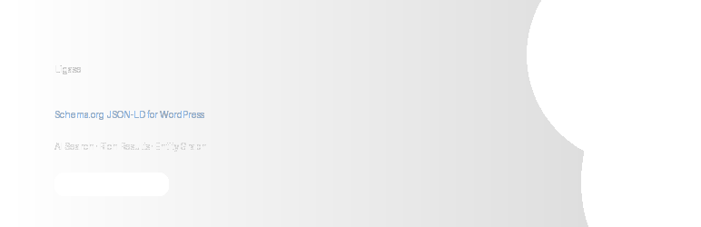

<p align="center">
  
</p>

<p align="center">
  <strong>Schema.org JSON-LD dla WordPress, zoptymalizowane pod Google Rich Results i AI Search.</strong>
</p>

<p align="center">
  <a href="https://wordpress.org/"></a>
  <a href="https://www.php.net/"></a>
  <a href="https://www.gnu.org/licenses/gpl-2.0.html"></a>
  
</p>

---

## Co to jest Ligase?

Ligase to wtyczka WordPress, ktora automatycznie generuje kompletny schema markup (JSON-LD) dla blogow. Laczy encje w `@graph`, buduje sygnaly E-E-A-T dla autorow, i optymalizuje dane strukturalne pod cytowanie przez AI (Google AI Overviews, ChatGPT, Perplexity).

**Dla kogo?** Profesjonalni blogerzy, ktorzy chca gwiazdki w Google i cytowania w AI Overviews bez dotykania kodu.

---

## Funkcje

### Schema Types
| Typ | Opis |
|-----|------|
| `Article` / `BlogPosting` / `NewsArticle` | Automatycznie dla kazdego posta |
| `Person` | Autor z `sameAs`, `knowsAbout`, `jobTitle` |
| `Organization` | Wydawca z logo, social links, Wikidata |
| `WebSite` | Z `SearchAction` (Sitelinks Search Box) |
| `BreadcrumbList` | Nawigacja okruszkowa |
| `FAQPage` | Blok Gutenberg + schema |
| `HowTo` | Blok Gutenberg + schema |
| `VideoObject` | Auto-wykrywanie YouTube embed |
| `Review` | Recenzje z ocena |

### AI Search Readiness Score (0-100)
Ocena gotowosci Twojej witryny na cytowanie przez AI. Mierzy:
- Linkowanie encji `@graph` z `@id`
- `sameAs` z Wikidata (najsilniejszy sygnal tozsamosci)
- `knowsAbout` na Organization i Person
- Jakosc obrazow (>= 1200px)
- Kompletnosc dat, autorow, breadcrumbs

### E-E-A-T Author Scoring
Per-autorowy wynik E-E-A-T z konkretnymi rekomendacjami:
- Biografia, stanowisko (`jobTitle`), obszary wiedzy (`knowsAbout`)
- Profile: LinkedIn, Twitter/X, Wikidata
- Avatar, powiazanie z organizacja (`worksFor`)

### Schema Auditor
Trzy tryby pracy:
- **Skan** — analiza istniejacego schema bez zmian
- **Uzupelniaj** — dodaje brakujace pola do cudzej schema
- **Zastap** — pelna zamiana slabej schema na wlasna

Wykrywa i obsluguje: Yoast SEO, Rank Math, All in One SEO, SEOPress, The SEO Framework, Slim SEO.

### Entity Detection Pipeline
4-poziomowy pipeline wykrywania encji:

```
Poziom 1: WordPress Native     (tagi, kategorie, autor)     ~0ms
Poziom 2: Analiza strukturalna  (linki Wiki, YouTube, bloki) ~5ms
Poziom 3: NER                   (osoby, organizacje, produkty) ~20ms
Poziom 4: Wikidata Lookup       (async via WP-Cron)          async
```

### Dodatkowe
- Bloki Gutenberg dla FAQ i HowTo
- Import/eksport ustawien (JSON)
- Auto-naprawa: daty ISO 8601, skracanie naglowkow, konwersja typow
- Cache schema z automatyczna invalidacja
- Bypass cache pluginow (WP Rocket, LiteSpeed, W3 Total Cache)
- Pelna internacjonalizacja (i18n ready)

---

## Wymagania

- WordPress 6.0+
- PHP 8.0+
- Brak zewnetrznych zaleznosci

---

## Instalacja

### Z pliku ZIP
1. Pobierz najnowszy release z [Releases](../../releases)
2. W WordPress: **Wtyczki > Dodaj nowa > Wgraj wtyczke**
3. Wybierz plik `ligase.zip` i kliknij **Zainstaluj**
4. Aktywuj wtyczke

### Reczna instalacja
```bash
cd wp-content/plugins/
git clone https://github.com/TWOJ-USER/ligase.git
```
Aktywuj w panelu WordPress.

### Konfiguracja po instalacji
1. Przejdz do **Ligase > Ustawienia**
2. Wypelnij dane organizacji (nazwa, logo, email)
3. Dodaj linki social media (Wikidata, LinkedIn, Facebook, itp.)
4. Edytuj profile autorow — dodaj `jobTitle`, `knowsAbout`, linki `sameAs`
5. Sprawdz wynik na **Ligase > Dashboard**

---

## Struktura projektu

```
ligase/
├── ligase.php                  # Glowny plik wtyczki (bootstrap)
├── uninstall.php               # Czyszczenie przy deinstalacji
├── readme.txt                  # WordPress.org readme
│
├── includes/
│   ├── class-plugin.php        # Singleton, init hooks
│   ├── class-generator.php     # Orkiestrator schema (@graph)
│   ├── class-output.php        # Renderowanie JSON-LD w wp_head
│   ├── class-cache.php         # Transients cache
│   ├── class-auditor.php       # Skanowanie i zastepowanie cudzej schema
│   ├── class-suppressor.php    # Wylaczanie schema innych wtyczek
│   ├── class-cache-bypass.php  # Omijanie cache pluginow
│   ├── class-score.php         # AI Readiness + E-E-A-T scoring
│   ├── class-ajax.php          # Endpointy AJAX
│   ├── class-logger.php        # Logger do pliku
│   │
│   ├── types/                  # Klasy generujace poszczegolne typy schema
│   │   ├── class-blogposting.php
│   │   ├── class-organization.php
│   │   ├── class-person.php
│   │   ├── class-website.php
│   │   ├── class-breadcrumb.php
│   │   ├── class-faqpage.php
│   │   ├── class-howto.php
│   │   ├── class-videoobject.php
│   │   └── class-review.php
│   │
│   └── entities/               # Pipeline wykrywania encji
│       ├── class-pipeline.php
│       ├── class-extractor-native.php
│       ├── class-extractor-structure.php
│       ├── class-extractor-ner.php
│       └── class-wikidata-lookup.php
│
├── admin/
│   ├── class-admin.php         # Menu, assets, hooks
│   ├── class-settings.php      # WordPress Settings API
│   └── views/                  # Widoki PHP admin
│       ├── dashboard.php       # Dashboard z AI Readiness Score
│       ├── settings.php        # Formularz ustawien
│       ├── posts.php           # Lista postow ze score
│       ├── auditor.php         # Panel audytora schema
│       ├── entities.php        # Encje + Wikidata + E-E-A-T
│       ├── tools.php           # Narzedzia (repair, cache, import/export)
│       └── meta-box.php        # Metabox w edytorze postow
│
├── blocks/                     # Bloki Gutenberg
│   ├── faq/
│   │   ├── block.json
│   │   └── index.js
│   └── howto/
│       ├── block.json
│       └── index.js
│
├── assets/
│   ├── css/admin.css           # Style panelu admin
│   └── js/admin.js             # Interaktywnosc AJAX
│
├── languages/                  # Pliki tlumaczen (i18n)
│
└── tests/                      # Testy jednostkowe (PHPUnit)
    ├── bootstrap.php
    └── unit/
        ├── AuditorTest.php
        ├── BlogPostingTest.php
        ├── NERTest.php
        └── ScoreTest.php
```

---

## Panel administracyjny

Wtyczka dodaje menu **Ligase** w panelu WordPress z podstronami:

| Strona | Opis |
|--------|------|
| **Dashboard** | AI Search Readiness Score, pokrycie schema, szybkie akcje |
| **Ustawienia** | Organizacja, social media, tryb pracy |
| **Posty** | Lista postow ze score, skan, naprawa, podglad JSON-LD |
| **Audytor** | Wykrywanie konfliktow, skanowanie, batch-naprawa |
| **Encje** | Wikidata search, E-E-A-T score autorow |
| **Narzedzia** | Auto-repair, cache, import/export |

Kazdy post ma rowniez **metabox "Schema Markup"** z wyborem typu i togglem FAQ/HowTo/Review.

---

## API dla deweloperow

### Filtry

```php
// Modyfikacja calego grafu schema
add_filter( 'ligase_schema_graph', function( array $graph ): array {
    // Dodaj wlasny typ schema
    $graph[] = [ '@type' => 'Event', 'name' => 'Moje wydarzenie' ];
    return $graph;
} );

// Modyfikacja pojedynczego typu
add_filter( 'ligase_blogposting', function( array $schema, int $post_id ): array {
    $schema['speakable'] = [
        '@type' => 'SpeakableSpecification',
        'cssSelector' => [ '.entry-title', '.entry-summary' ],
    ];
    return $schema;
}, 10, 2 );

// Dostepne filtry per typ:
// ligase_blogposting, ligase_person, ligase_organization,
// ligase_website, ligase_breadcrumb
```

### AJAX Endpoints

Wszystkie endpointy wymagaja nonce `ligase_admin` i capability `manage_options`.

| Akcja | Opis |
|-------|------|
| `ligase_dashboard_stats` | Statystyki pokrycia schema |
| `ligase_get_readiness_score` | AI Readiness Score z rekomendacjami |
| `ligase_scan_post` | Skan pojedynczego posta |
| `ligase_scan_all_posts` | Batch skan wszystkich postow |
| `ligase_fix_post` | Naprawa schema posta |
| `ligase_fix_all_posts` | Batch naprawa ponizej progu |
| `ligase_preview_json` | Podglad JSON-LD dla posta |
| `ligase_wikidata` | Wyszukiwanie encji Wikidata |
| `ligase_get_author_scores` | E-E-A-T score autorow |
| `ligase_get_plugin_conflicts` | Wykrywanie konfliktow |
| `ligase_export_settings` | Eksport ustawien JSON |
| `ligase_import_settings` | Import ustawien JSON |
| `ligase_auto_repair` | Auto-naprawa (daty, naglowki, typy) |
| `ligase_clear_cache` | Czyszczenie cache schema |

---

## Testowanie

```bash
# Wymagany PHP 8.0+ i Composer
composer install
./vendor/bin/phpunit
```

Testy jednostkowe pokrywaja:
- `AuditorTest` — scoring schema, wykrywanie problemow
- `BlogPostingTest` — generowanie BlogPosting schema
- `NERTest` — ekstrakcja encji z tresci
- `ScoreTest` — kalkulacja AI Readiness Score

---

## Zgodnosc

- **Schema.org** — pelna zgodnosc ze specyfikacja
- **Google Search Central** — zgodnosc z wytycznymi (marzec 2026)
- **WordPress Coding Standards** — WPCS compatible
- **GDPR** — brak zbierania danych osobowych, brak zewnetrznych requestow (Wikidata opcjonalnie, na zadanie usera)

---

## Roadmap

- [ ] Dashboard widget z Google Schema Changelog
- [ ] WP-CLI commands (`wp ligase scan`, `wp ligase score`)
- [ ] REST API endpoints
- [ ] Multisite support
- [ ] Automatyczna walidacja schema (Google Rich Results Test API)
- [ ] Integracja z Google Search Console

---

## Licencja

Ligase jest licencjonowany na [GNU General Public License v2.0](LICENSE) lub pozniejszej.

---

## Autor

Stworzone przez **[Marcin Zmuda](https://marcinzmuda.com)**.

Znalazles blad? [Zglos issue](../../issues) lub otworz pull request.
